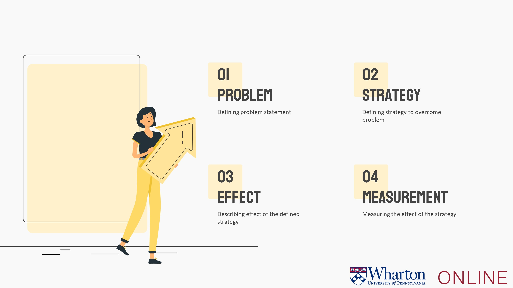
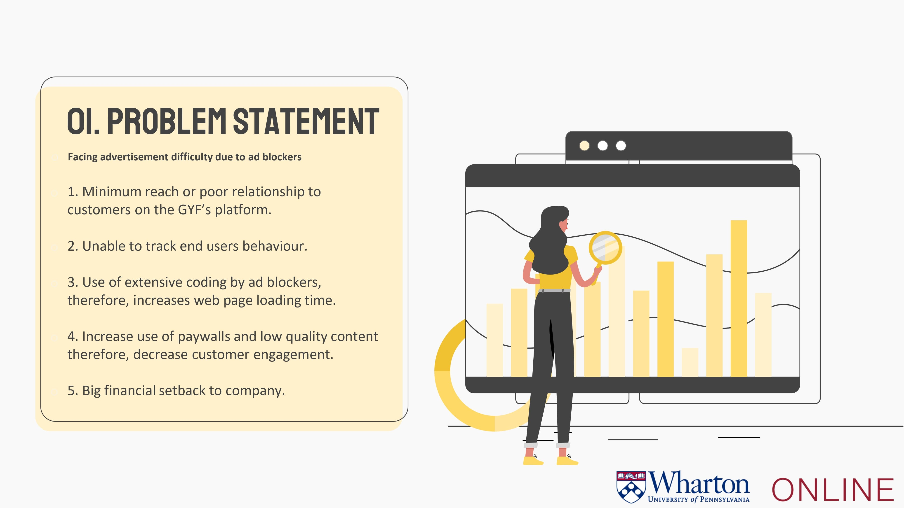
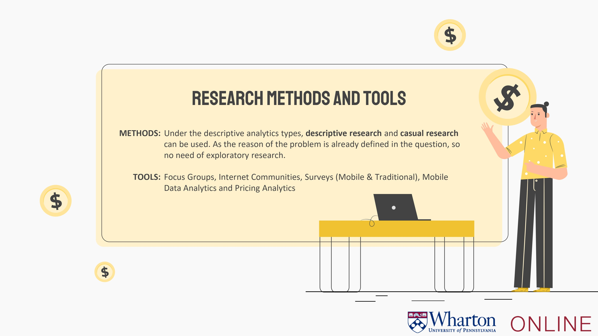
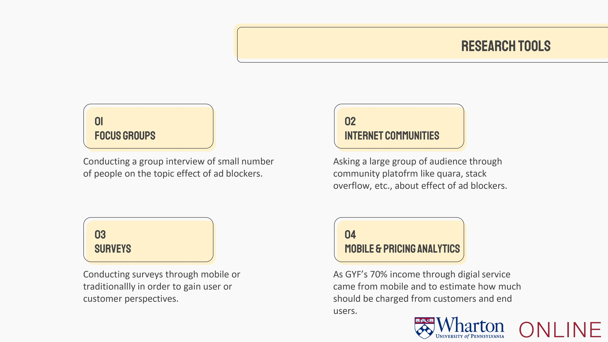
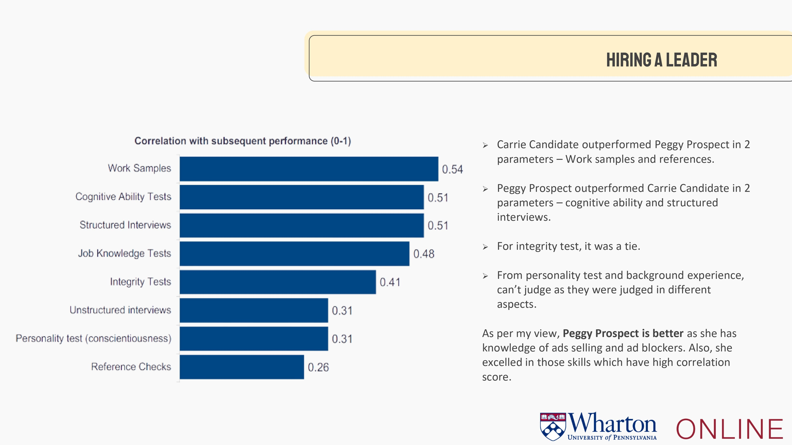
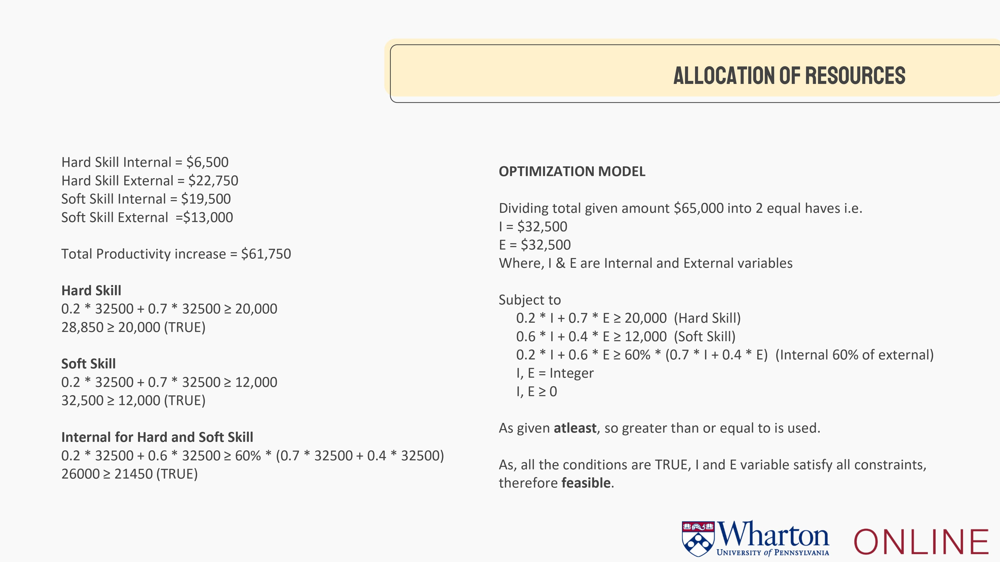
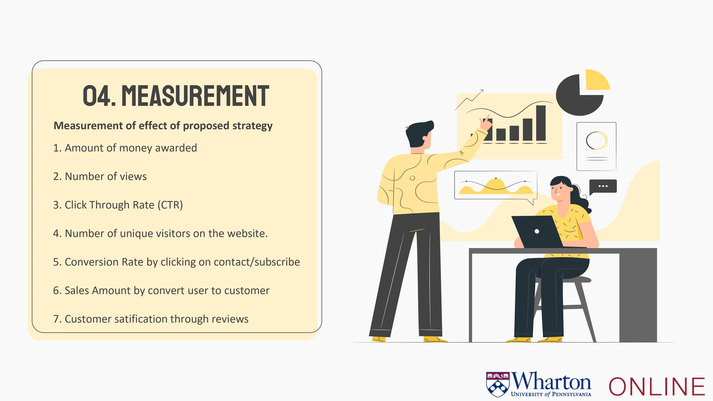
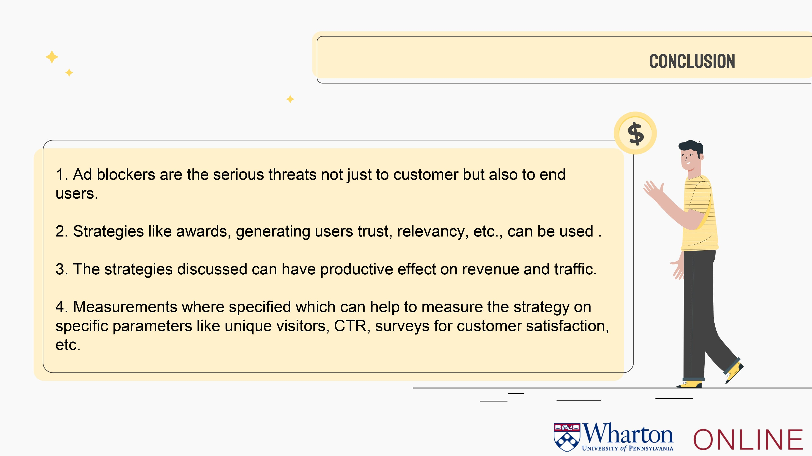

# GOYAFACE (GYF) Advertisement Business

As a part of Business Analytics specialization from Wharton School, University of Pennsylvania, worked on the capstone project.

## Presentation Slides

